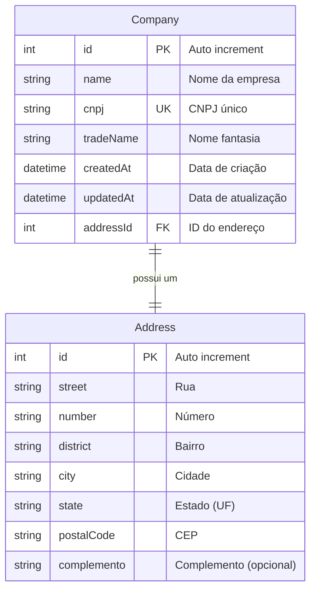

# GestorPro

Sistema de gestão empresarial desenvolvido com React + TypeScript (frontend) e NestJS + Prisma (backend).

## 📋 Pré-requisitos

Antes de começar, certifique-se de ter as seguintes ferramentas instaladas:

- [Docker](https://www.docker.com/get-started) (versão 20.10 ou superior)
- [Git](https://git-scm.com/)

## 🚀 Como rodar o projeto

### Opção 1: Setup Automático (Recomendado) ⚡

#### 1. Clone o repositório
```bash
git clone https://github.com/dsbellini/GestorPro.git
cd gestorpro
```

#### 2. Execute o script de setup

**Windows (PowerShell):**
```powershell
.\setup.ps1
```

**Linux/Mac (Bash):**
```bash
chmod +x setup.sh
./setup.sh
```

Pronto! 🎉 O script irá automaticamente:
- ✅ Criar os arquivos de configuração (.env)
- ✅ Subir os containers Docker
- ✅ Executar as migrações do banco
- ✅ Configurar tudo para você

#### 3. Acesse a aplicação
- **Frontend**: http://localhost:5174
- **Backend API**: http://localhost:3001
- **Banco de dados**: localhost:3306

---

### Opção 2: Configuração Manual 🔧

#### 1. Clone o repositório
```bash
git clone https://github.com/dsbellini/GestorPro.git
cd gestorpro
```

#### 2. Configure as variáveis de ambiente

**Backend (.env):**
```bash
cp backend/.env.example backend/.env
```

**Frontend (.env):**
```bash
cp frontend/.env.example frontend/.env
```

#### 3. Execute o projeto com Docker

```bash
# Subir todos os serviços
docker-compose up -d

# Verificar se os containers estão rodando
docker-compose ps
```

#### 4. Execute as migrações do banco de dados

```bash
# Executar as migrações do Prisma
docker-compose exec backend npx prisma migrate deploy

# Gerar o cliente Prisma
docker-compose exec backend npx prisma generate
```

#### 5. Acesse a aplicação

- **Frontend**: http://localhost:5173
- **Backend API**: http://localhost:3000
- **Banco de dados**: localhost:3306

## 🧪 Testes

### Executar testes
```bash
# Testes unitários (backend)
docker-compose exec backend npm test

# Testes de integração E2E (backend)
docker-compose exec backend npm run test:e2e

# Testes com coverage (cobertura de código)
docker-compose exec backend npm run test:cov

# Testes em modo watch (re-executa quando arquivos mudam)
docker-compose exec backend npm run test:watch

# Rodar um teste específico
docker-compose exec backend npm test -- company.service.spec.ts
```

## 📁 Estrutura do projeto

```
gestorpro/
├── docker-compose.yml          # Configuração do Docker Compose
├── README.md                   # Este arquivo
├── backend/                    # API NestJS
│   ├── src/                   # Código fonte
│   ├── prisma/                # Schema e migrações do banco
│   ├── Dockerfile             # Imagem Docker do backend
│   ├── package.json           # Dependências do backend
│   └── .env                   # Variáveis de ambiente (criar)
└── frontend/                   # Aplicação React
    ├── src/                   # Código fonte
    ├── public/                # Arquivos estáticos
    ├── Dockerfile             # Imagem Docker do frontend
    ├── package.json           # Dependências do frontend
    └── .env                   # Variáveis de ambiente (criar)
```

## 🔧 Tecnologias utilizadas

### Backend
- **NestJS** - Framework Node.js
- **Prisma** - ORM para banco de dados
- **MySQL** - Banco de dados
- **TypeScript** - Linguagem de programação

### Frontend
- **React** - Biblioteca de interface
- **TypeScript** - Linguagem de programação
- **Material-UI** - Biblioteca de componentes
- **Vite** - Build tool
- **Axios** - Cliente HTTP

## 🗄️ Estrutura do banco de dados

### Diagrama Entidade-Relacionamento (ER)



### Relacionamentos

- **Company → Address**: Relacionamento 1:1
  - Uma empresa possui **exatamente um** endereço
  - Chave estrangeira: `addressId` em `Company`
  - Cascata: Ao deletar uma empresa, o endereço é deletado automaticamente (`onDelete: Cascade`)

### Índices e Constraints

- **company.cnpj**: Índice único (UK) - garante que não existam duas empresas com o mesmo CNPJ
- **company.id**: Chave primária auto-incrementável
- **address.id**: Chave primária auto-incrementável
- **company.addressId**: Chave estrangeira referenciando `address.id`

### Campos Obrigatórios

**Company:**
- ✅ `name` (Nome)
- ✅ `cnpj` (CNPJ único)
- ✅ `tradeName` (Nome fantasia)
- ✅ `addressId` (Referência ao endereço)

**Address:**
- ✅ `street` (Rua)
- ✅ `number` (Número)
- ✅ `district` (Bairro)
- ✅ `city` (Cidade)
- ✅ `state` (Estado - 2 caracteres)
- ✅ `postalCode` (CEP - 8 dígitos)
- ❌ `complemento` (Opcional)

